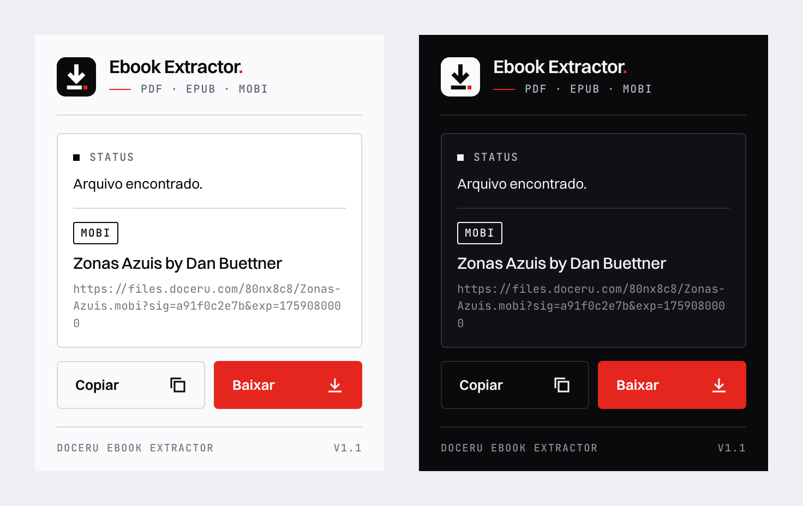

# Doceru Ebook Extractor

Extensão para Chrome que encontra o arquivo de um documento no Doceru.com e permite copiar o link ou baixá-lo já com o nome do livro. Funciona com PDF, EPUB e MOBI.



## Como funciona

Depois que o CAPTCHA é resolvido, o Doceru pede ao servidor o endereço do arquivo para exibi-lo na página. A extensão captura essa resposta e mostra no popup o formato, o título e o link, com as opções de copiar ou baixar.

## Instalação

```bash
git clone https://github.com/FredSax-dev/doceru-ebook-extractor.git
```

1. Abra `chrome://extensions` no Chrome.
2. Ligue o **Modo do desenvolvedor**, no canto superior direito.
3. Clique em **Carregar sem compactação** e escolha a pasta `doceru-ebook-extractor`.

## Uso

1. Abra a página de um documento no Doceru.com, por exemplo `https://doceru.com/doc/80nx8c8`.
2. Resolva o CAPTCHA e espere o documento aparecer.
3. Clique no ícone da extensão e em **Extrair link**.
4. Escolha **Copiar** ou **Baixar**.

Se a extensão foi instalada ou atualizada com a página já aberta, recarregue a página antes de resolver o CAPTCHA.

## Permissões

- `activeTab` e `scripting`: ler o link do arquivo na aba atual.
- `downloads`: salvar o arquivo com o nome do livro.
- Acesso a `doceru.com`: capturar o link de EPUB e MOBI, que não fica visível na página.

## Licença

MIT. Veja [LICENSE](LICENSE).

## Autor

Desenvolvido por **FredSax-dev**.
